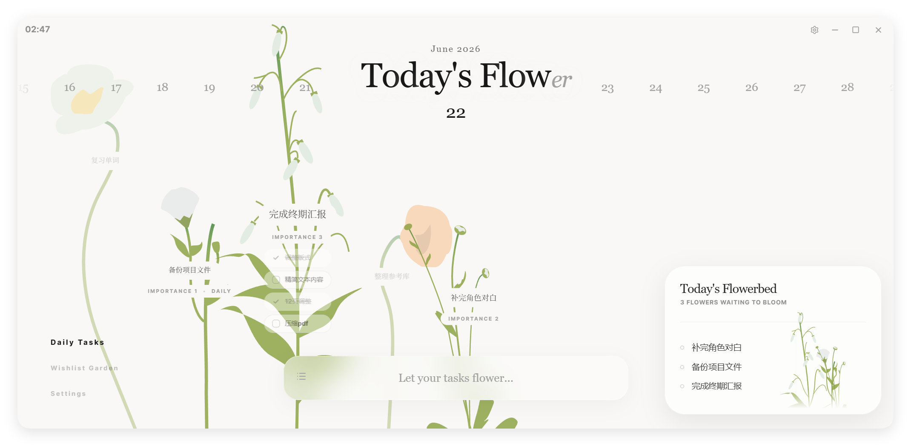

<div align="center">
  
  <h1>Today's Flower</h1>
  <p>A garden-style desktop todo app with a softer sense of order.</p>
</div>

<br />

<p align="center">
<a href="./README.md">简体中文</a> · English
</p>

**Today's Flower** is a personal desktop todo app. It keeps only what needs to be seen today, softens the strict order of a list, and lets tasks stay in view in a calmer way.

Write down today's tasks and let them grow and bloom in the garden. At the end, you will see a garden that belongs to today.

[Try the web version](https://yuanjiling.github.io/todays-flower/) (system reminders are unavailable on the web version)



## Origin / Credits

**Today's Flower** is rebuilt from the core framework of [J-Flow](https://github.com/eglantine-shell/J-Flow), with the experience redesigned around personal use.

## Features

- **Today view**
  Focuses only on tasks that need to appear today.
- **Garden layout**
  Tasks are shown as flowers and naturally placed on the screen.
- **Bloom feedback**
  When a task is completed, its flower blooms and fades into the background.
- **Reminders**
  Pop-ups only bring back unfinished tasks.

## Selected Plants

Bellflower, tulip, balloon flower, daisy, poppy, ornamental onion, fountain grass, fern.

## Download and Install

Download the version for your system from the [Release page](https://github.com/yuanjiling/todays-flower/releases).

- **Windows**: download the `.exe` file and run it.

## How to Use

Write today's task in the input field at the bottom.

The task will appear in the today view and generate a flower in the garden.

After you complete a task, the flower will bloom and fade into the flowerbed.

The grass garden is used to keep things you may want to do later. When needed, you can plant them back into today's flowerbed.

## Privacy

Task data is saved locally by default.
Exported backup files are kept and managed by the user.

## Development and Build

This project is built with React, Vite, TypeScript, Tailwind CSS, and Electron.

```bash
npm install
npm run dev
```

Common commands:

```bash
npm run dev:web        # Start the Web development server
npm run start:desktop  # Start the Electron desktop app
npm run lint           # Run TypeScript checks
npm run build:web      # Build the Web output
npm run build:desktop  # Build the desktop app
```

<br />

