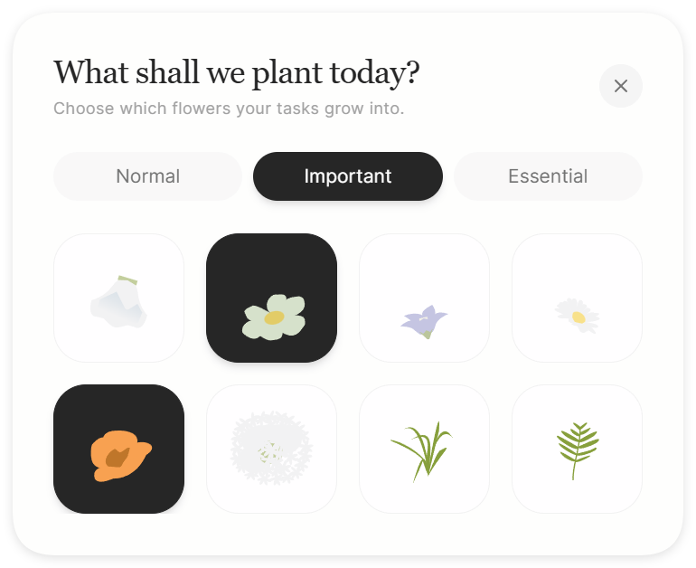

<div align="center">
  
  <h1>Today's Flower</h1>
  <p>一个弱秩序的花园式桌面待办。</p>
</div>

<br />

<p align="center">  
简体中文 · <a href="./README.en.md">English</a>  
</p>

**Today's Flower** 是一款桌面端个人待办应用。它仅保留当日需要被看见的内容，弱化列表的强排序感，让任务以更松弛的方式停留在视野里。

写下今天的任务，让它们在花园中生长、开放。最后，你会看见一座属于今天的花园。

[网页版试用](https://yuanjiling.github.io/todays-flower/)（无系统提醒功能）


<p align="center">
  
  
</p>

## 来源 / 致谢

**Today’s Flower** 基于 [J-Flow](https://github.com/eglantine-shell/J-Flow) 的核心框架重构而来，并围绕个人使用习惯进行了重新设计。

## 特点

- **今日视图**
  只处理今天需要出现的任务。
- **花园分布**
  任务以花朵呈现，自然分布在画面中。
- **开花反馈**
  完成后，花朵开放，并退到背景。
- **提醒**
  弹窗只通知仍未完成的事项。

## 所选花材

风铃草、郁金香、桔梗、雏菊、虞美人、观赏葱、喷泉草、蕨。

## 下载与安装

在 [Release 页面](https://github.com/yuanjiling/todays-flower/releases) 下载对应系统版本。

- **Windows**：下载 `.exe` 文件后运行。

## 使用说明

在底部输入框写下今天的任务。

任务会出现在当天视图中，并在花园里生成对应的花朵。

完成任务后，花会开放，并变淡留在花圃中。

种草花园用于存放以后想做的事。需要执行时，可以再种回今日花圃。

## 隐私

任务数据默认保存在本机。
导出的备份文件由用户自行保存。

## 开发与构建

本项目使用 React、Vite、TypeScript、Tailwind CSS 和 Electron 构建。

```bash
npm install
npm run dev
```

常用命令：

```bash
npm run dev:web        # 启动 Web 开发服务
npm run start:desktop  # 启动 Electron 桌面端
npm run lint           # 运行 TypeScript 检查
npm run build:web      # 构建 Web 产物
npm run build:desktop  # 构建桌面应用
```

<br />
